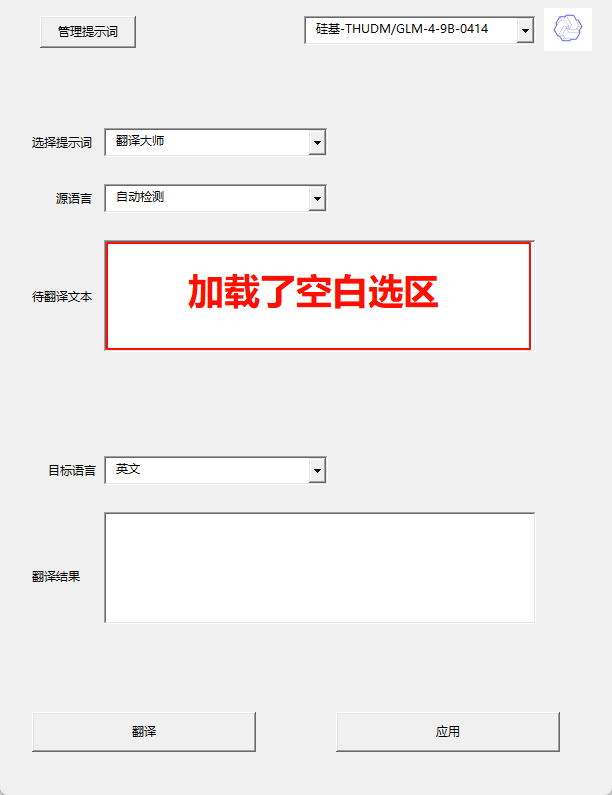
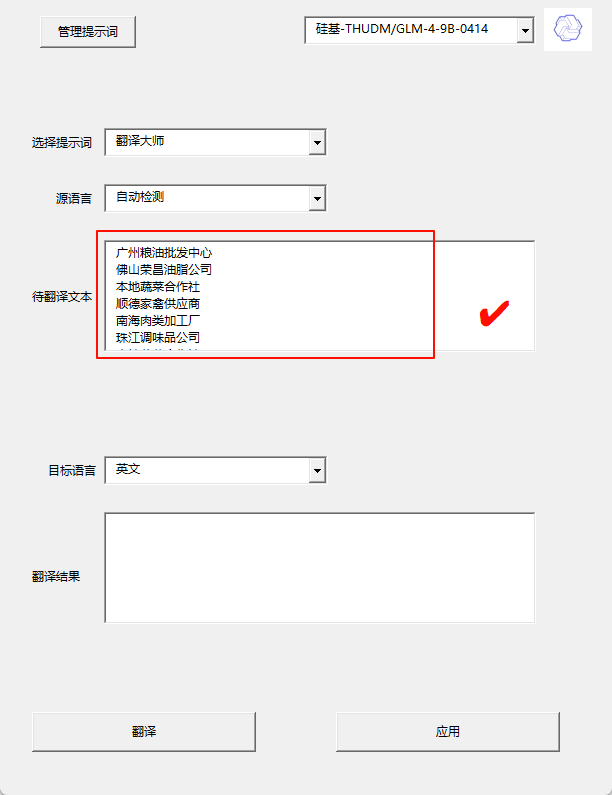
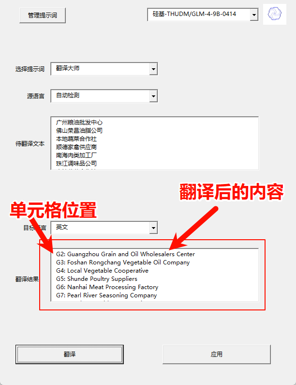
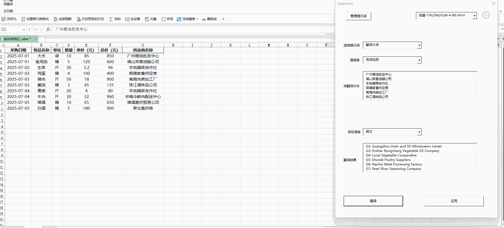
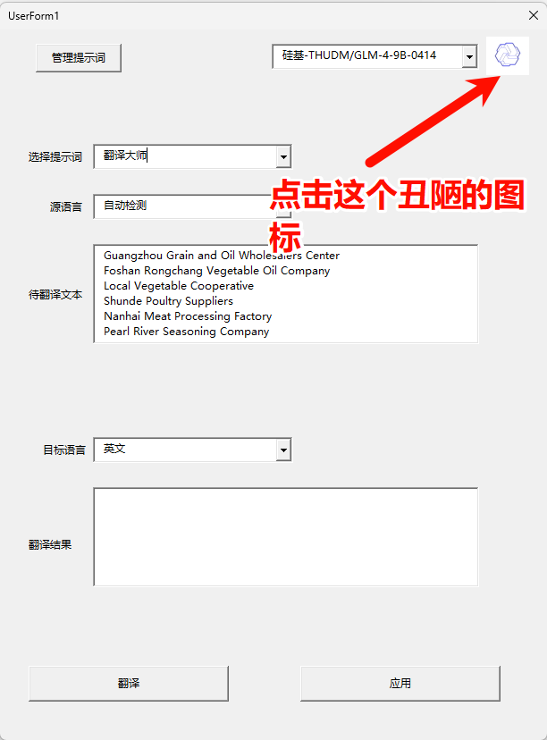
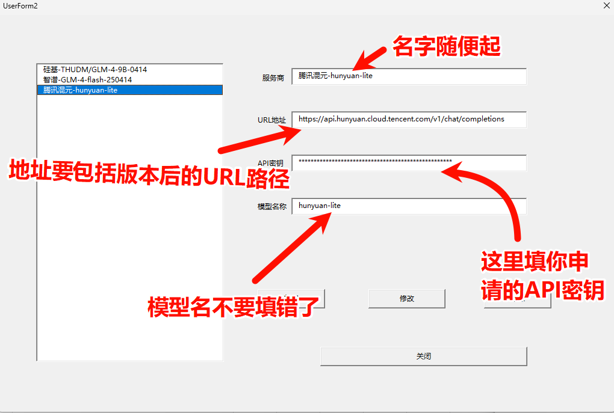

# ExcelSmartTranslator - 多语言智能翻译加载项 🌐

## 📌 项目简介

本插件为Excel开发者设计的智能化翻译工具，支持一键翻译EXCEL单元格内容，不需要再去手动复制了。
确保翻译的结果精准的写入选择的单元格。

## ✨ 功能亮点

- **文本翻译**：支持单个**单元格/选区**文本的中英日韩多语言互译
- **格式保持**：自动保留单元格合并状态、字体样式和数据验证规则（AI写的，我还没有验证格式是不是有变化）
- **术语库功能**：自定义专业术语映射表（如特定行业词汇）
- **离线核心**：基础翻译模块无需网络即可运行（如果你安装了ollama，那么原则上它应该也支持ollama，说是无需联网也不算夸大）
- **错误重试**：失败翻译自动记录并支持批量重试（报错就再点一次吧）
- **多线程处理**：大型工作簿分块加载提升翻译效率

## 🛠 快速安装指南

## 📁 步骤一：放置加载文件

1. 下载项目，或者点击[这里](https://github.com/wilderkid/ExcelSmartTranslator/releases)下载 （你只需要 code文件夹下的 Smart Translator.xlam 这个文件）
2. 定位存储路径（推荐），将Smart Translator.xlam 这个文件复制到下面这个文件夹内：
   `C:\Users\用户名\AppData\Roaming\Microsoft\AddIns`
3. 快捷访问方式：
   `Windows + R → %appdata%\Microsoft\AddIns`

## ⚙️ 步骤二：激活加载项

1. Excel内操作路径：
   `文件 → 选项 → 加载项 → 管理: Excel加载项 → 转到...`
2. 激活方式：
   - 首次启用：点击【浏览】手动定位.xlam文件
   - 已放置时：直接勾选插件名称
3. 验证安装：
   功能区应新增「智能翻译」选项卡

## 🚀 使用教程

### 如何执行翻译任务

1. [选择区域] 拖动选择需要翻译的内容（重要！！！ 要先选中需要翻译的区域，**不要选空格**(没做空格处理），冷知识：ctrl键可以多选）

   

2. 正常选择了选区

   

3. 选择目标语言后，直接点击**翻译**按钮

   

4. 点击**应用**，结果就会被写入选区

   

5. 在这之前，你要先配置 API

   

6. 配置 API

   

7.  如果你不想花钱去买chatgpt，也可以在下面找到一些免费的模型

   - [硅基流动](https://cloud.siliconflow.cn/i/5AuicpZd)：注册就有2000万token，还有一些免费的模型给你用
   - [Gemini](https://aistudio.google.com/app/apikey)：谷歌的顶级大模型，每天都有免费额度
   - [魔搭社区](https://modelscope.cn/my/myaccesstoken)： 开源社区，每天2000次免费额度
   - [智谱](https://open.bigmodel.cn/usercenter/proj-mgmt/apikeys)：免费模型给你用，量大管饱

## ⚙ 技术构思

核心技术： VBA + Excel COM 交互  

## 🟠 注意事项

1. 适用环境：Excel 2016及更新版本
2. 只支持 office EXCEL，不支持WPS，WPS党可以退了
3. 提示词不要指定语言，例如翻译成英文什么的，页面可以选
4. 不支持思考模型（没做适配，可能报错）
5. 只支持openai 兼容 API（硅基/智谱），其他的没有适配
6. 大模型的设置被写死了，有机会再更新吧
7. 弹窗弹出后，无法再操作EXCEL，叉掉才行

